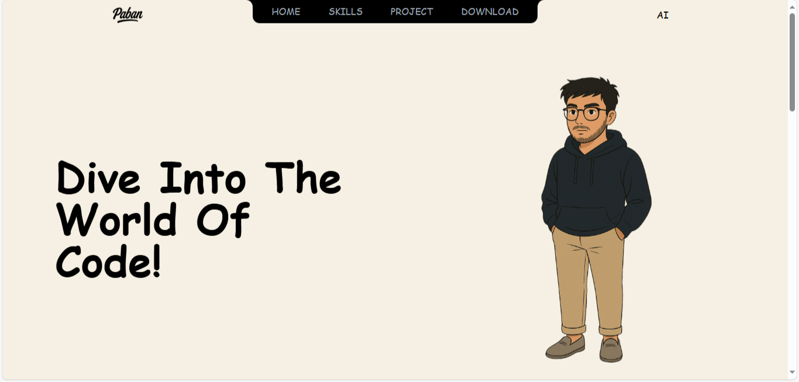

# 🚀 My Developer Portfolio  

This is my personal portfolio website built with **React (Vite)**, styled using **Tailwind CSS**, and animated with **Framer Motion**.  
It highlights my **skills, projects, and achievements** while providing a simple way to connect with me.  

🌐 **Live Demo:** [View Portfolio](https://portfolio-lime-zeta-25.vercel.app/)  

---

## ✨ Features
- Responsive and modern UI with Tailwind CSS  
- Smooth animations powered by Framer Motion  
- Iconography with **Remix Icon** and **Lucide React**  
- Sections for Home, Skills, Projects, and Resume/Download  
- Hosted & deployed seamlessly on Vercel  

---

## 🛠️ Tech Stack
- **React (Vite)** – Fast & modern frontend setup  
- **Tailwind CSS** – Utility-first styling  
- **Framer Motion** – Animations & transitions  
- **Remix Icon + Lucide React** – Beautiful icons  
- **Vercel** – Deployment and hosting  

---

## 📸 Screenshots
 <!-- You can replace with an actual screenshot -->

---
